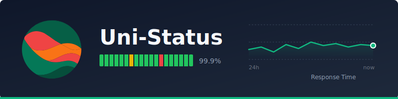

<p align="center">
  
</p>

<p align="center">
  <a href="https://github.com/unified-projects/uni-status/actions/workflows/test.yml">
    
  </a>
  
</p>

---

Open-source status monitoring platform with uptime checks, status pages, incident management, and multi-channel alerting.

## Deploy

Deploy Uni-Status using the official Docker images:

```yaml
# docker-compose.yml
services:
  haproxy:
    image: haproxy:2.9-alpine
    container_name: uni-status-haproxy
    ports:
      - "80:80"
    volumes:
      - ./haproxy.cfg:/usr/local/etc/haproxy/haproxy.cfg:ro
    depends_on:
      - web
      - api

  postgres:
    image: postgres:16-alpine
    container_name: uni-status-postgres
    environment:
      POSTGRES_USER: uni_status
      POSTGRES_PASSWORD: change_this_password
      POSTGRES_DB: uni_status
    volumes:
      - postgres_data:/var/lib/postgresql/data
    healthcheck:
      test: ["CMD-SHELL", "pg_isready -U uni_status"]
      interval: 5s
      timeout: 5s
      retries: 5

  redis:
    image: redis:7-alpine
    container_name: uni-status-redis
    command: redis-server --appendonly yes
    volumes:
      - redis_data:/data
    healthcheck:
      test: ["CMD", "redis-cli", "ping"]
      interval: 5s
      timeout: 5s
      retries: 5

  migrations:
    image: unified-projects/uni-status-migrations:latest
    container_name: uni-status-migrations
    env_file:
      - .env
    environment:
      - DATABASE_URL=postgresql://${POSTGRES_USER:-uni_status}:${POSTGRES_PASSWORD:-change_this_password}@postgres:5432/${POSTGRES_DB:-uni_status}
    depends_on:
      postgres:
        condition: service_healthy

  api:
    image: unified-projects/uni-status-controller:latest
    container_name: uni-status-api
    env_file:
      - .env
    environment:
      - DEPLOYMENT_TYPE=SELF-HOSTED
      - UNI_STATUS_URL=${UNI_STATUS_URL:-http://localhost}
      - UNI_STATUS_DB_URL=postgresql://${POSTGRES_USER:-uni_status}:${POSTGRES_PASSWORD:-change_this_password}@postgres:5432/${POSTGRES_DB:-uni_status}
      - UNI_STATUS_REDIS_URL=redis://redis:6379
      - UNI_STATUS_API_PORT=3001
      - UNI_STATUS_AUTH_SECRET=${UNI_STATUS_AUTH_SECRET:-change_this_super_secret_key}
    depends_on:
      migrations:
        condition: service_completed_successfully
      redis:
        condition: service_healthy

  web:
    image: unified-projects/uni-status-console:latest
    container_name: uni-status-web
    env_file:
      - .env
    environment:
      - DEPLOYMENT_TYPE=SELF-HOSTED
      - UNI_STATUS_URL=${UNI_STATUS_URL:-http://localhost}
      - UNI_STATUS_DB_URL=postgresql://${POSTGRES_USER:-uni_status}:${POSTGRES_PASSWORD:-change_this_password}@postgres:5432/${POSTGRES_DB:-uni_status}
      - UNI_STATUS_AUTH_SECRET=${UNI_STATUS_AUTH_SECRET:-change_this_super_secret_key}
    depends_on:
      - api

  workers:
    image: unified-projects/uni-status-workers:latest
    container_name: uni-status-workers
    env_file:
      - .env
    environment:
      - DEPLOYMENT_TYPE=SELF-HOSTED
      - UNI_STATUS_DB_URL=postgresql://${POSTGRES_USER:-uni_status}:${POSTGRES_PASSWORD:-change_this_password}@postgres:5432/${POSTGRES_DB:-uni_status}
      - UNI_STATUS_REDIS_URL=redis://redis:6379
    depends_on:
      migrations:
        condition: service_completed_successfully
      redis:
        condition: service_healthy

volumes:
  postgres_data:
  redis_data:
```

Create a `.env` file with:

```
POSTGRES_USER=uni_status
POSTGRES_PASSWORD=your_secure_password
POSTGRES_DB=uni_status

UNI_STATUS_URL=http://localhost
UNI_STATUS_AUTH_SECRET=your_super_secret_key
```

Save this as `haproxy.cfg`:

```cfg
global
    log stdout format raw local0
    maxconn 4096

defaults
    log global
    mode http
    option httplog
    option dontlognull
    option forwardfor
    timeout connect 5s
    timeout client 50s
    timeout server 50s

frontend http_front
    bind *:80

    # Route /api/auth/* to web backend (better-auth is in Next.js)
    acl is_auth path_beg /api/auth
    use_backend web_backend if is_auth

    # Route API traffic to API backend
    acl is_api path_beg /api
    use_backend api_backend if is_api

    # Health check endpoint for HAProxy itself
    acl is_root path /
    use_backend web_backend if is_root

    default_backend web_backend

backend api_backend
    balance roundrobin
    option httpchk GET /health
    server api api:3001 check inter 5s fall 3 rise 2

backend web_backend
    balance roundrobin
    option httpchk GET /health
    server web web:3000 check inter 5s fall 3 rise 2
```

## Develop

For local development with hot-reload, see [CONTRIBUTING.md](CONTRIBUTING.md).

## Test

```bash
cd tests && docker compose run --rm test-runner
```

## License

AGPL-3.0
